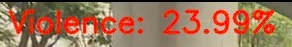

<center><h1>Báo cáo</h1></center>


## Bài báo cáo nhận diện hành vi bạo lực (Violent_Behavior)

Dự án "Violent_Behavior" tập trung vào việc phát hiện và phân loại hành vi bạo lực trong video sử dụng các mô hình học sâu. Mục tiêu là xây dựng một hệ thống có khả năng nhận diện tự động các hành động bạo lực, từ đó hỗ trợ trong các ứng dụng giám sát an ninh, phân tích nội dung video, và các lĩnh vực liên quan.

### Thành viên:

| MSV        | Họ và tên           | Tên trường           |
| :--------- | :------------------ | :------------------- |
| 1771020729 | Nguyễn Thanh Tùng   | Dai Nam University  |
| 1771020771 | Lê Văn Vượng        | Dai Nam University  |
| 1771020650 | Nguyễn Quang Thịnh | Dai Nam University  |
<br>

### Phân công công việc:

* **Nguyễn Thanh Tùng:**
    * Xây dựng mô hình CNN 2D.
    * Xây dựng mô hình CNN 3D.
    * Huấn luyện và đánh giá mô hình.
* **Lê Văn Vượng:**
    * Thu thập và tiền xử lý dữ liệu.
    * Xây dựng mô hình CNN 3D.
    * Phân tích kết quả.
* **Nguyễn Quang Thịnh:**
    * Viết báo cáo và tài liệu.
    * Làm PowerPoint

<br><hr>


<center><h2>Yêu cầu + Giải thích</h2></center>

## PIP
> Môi trường ảo:

-Bước 1:Tao môi trường ảo + tên môi trường
```bash
python -m venv env_violent
```
-Bước 2:Truy vập Môi trường
```bash
cd env_violent/Scripts
```
-Bước 3: Kích hoạt  môi trường
```bash
activate.bat
```
-Nếu bạn muốn tắt môi trường ảo:
```bash
deactivate.bat 
```

>  Cài đặt  thư  viên  cần thiết 

```bash
pip install -r requiment.txt
``` 
## DataSet
>  Có hai loại  DataSet mà chúng tôi đã train với models:
- `Data1`: Đại diện cho dataset `'Hockey Fight Vidoes'`:
  - Download về máy: [Tại đây](./Data/DataSet/Download_Data1.py) 
  - Link Download kaggle: [Tại đây](https://www.kaggle.com/datasets/yassershrief/hockey-fight-vidoes/code)

- `Data2` Đại diện cho dataset mà chúng tôi sưu tầm được:
  - Download: [Tại đây](https://drive.google.com/file/d/1tWyFvSRmyhA_lbGTYzqlWT3_Ctl76Zue/view?usp=sharing)

## Cấu trúc Folder:
>Folder Data gồm:
- Data_Quay: Dùng để chạy thử Video cho models nhận dạng sau khi đã train xong. Các dữ liệu này là video mà chúng tôi tự quay.
- Data_Test: Dùng để chạy thử Video cho models nhận dạng sau khi đã train xong.
- DataSet:  Chứa các Dữ liệu để train

>Folder models:
- Dùng để chứa các models sau khi đã train được vào đây

>Folder Train:
- Chứa code trên colad và code trên máy tính cá nhân của bạn.

>Folder Use:
- Các Code dùng để sử dụng models sau khi đã train xong:
    > Gồm các file:
    - [Camera](./Use/Sử%20dụng%20Model%20Camera%20V1%203D%20CNN.py) -> Dùng để nhận diện trước tiếp từ camera máy tính của bạn.
    - [Frame](./Use/Sử%20dụng%20Model%20Frame%20V2%203D%20CNN.py) -> Nhận diện tùnw fame  qua máy tính cá nhân của bạn
    - [Lưu Video](./Use/Sử%20dụng%20Model%20Video%20V1%203D%20CNN.py) ->  Dùng để models nhận diện và lưu vào 1 file mới cho bạn
    - [Show Video](./Use/Sử%20dụng%20Model%20Video%20V3%203D%20CNN.py) -> Sử dụng nhận diện và show video trước tiếp lên màn hình của bạn đánh giá video cho bạn
    - [Show Video + Lưu video](./Use/Sử%20dụng%20model%20Video%20V3.1%203D%20CNN.py) -> Nhận diện video trực tiếp và lưu video nhận diện vào file
    - [Show Video + Lưu video + Lưu Frame](./Use/Sử%20dụng%20model%20Video%20V3.2%203D%20CNN.py) -> Nhận diện trực tiếp và lưu video . Ngoài ra chúng còn lưu những frame quan trọng Hiệu sâu hơn vào đây xem cách chúng hoạt động [Tại đây](./Use/README.md)

Cú pháp:
```bash
python <tên_file>.py
```
## Đánh giá:
> Trong [File này](./reluts/model%20comparison.docx) Chứa các thông số mà tôi đã đánh giá được bạn có thể đọc và xem kĩ hơn.

> Ngoài ra đây  là kết quả mà tôi cảm thấy nó trả về biểu đồ ok nhất thời điểm hiện tại mà tôi train được của models 3D CNN


 > biểu đồ 3D CNN


## Kết quả: 
Kết quả nhận diện đươc hành vi bất thường nơi đám đông là:


- Kết quả==> 

## overleaf:


Trong đây chỉ là nói tổng quan và giải thích Git này chứa những gì và các cấu trúc ( Cách hoạt động của chúng) Bạn có thể xem chi tiết qua ``OverLeaf`` [Tại đâu](https://www.overleaf.com/4673122492ptyhpnwpwmpz#bb03c1)