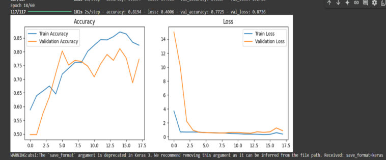
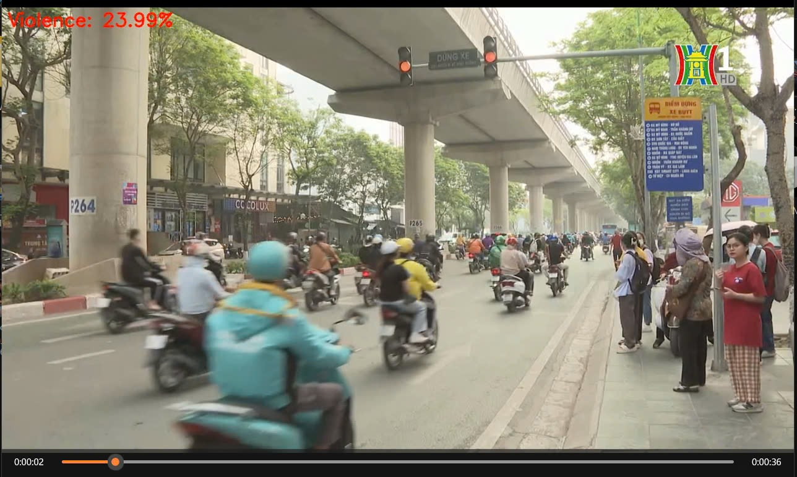

<h1 align="center">Nhận diện hành vi bạo lực trong trường học</h1>

<div align="center">

<p align="center">
  
  
</p>

[](https://www.facebook.com/DNUAIoTLab)
[](https://fitdnu.net/)
[](https://dainam.edu.vn)

</div>

<h2 align="center">Mô hình phát hiện hành vi bạo lực học đường sử dụng
mạng nơ-ron tích chập CNN</h2>

<p align="left">
  
Dự án "Violent_Behavior" tập trung vào việc phát hiện và phân loại hành vi bạo lực trong video sử dụng các mô hình học sâu. Mục tiêu là xây dựng một hệ thống có khả năng nhận diện tự động các hành động bạo lực, từ đó hỗ trợ trong các ứng dụng giám sát an ninh, phân tích nội dung video, và các lĩnh vực liên quan.

</p>

---

## 🌟 Giới thiệu

- **Mô hình nhận diện** Mô hình sẽ nhận diện qua thông qua video và trả về kết quả ngay bên góc trái màn hình.
- **💡 Thông báo:** Khi nhận dạng được nếu mô hình nhận dạnh được đó là hành vi bạo lực trên 75% sẽ hiện thông báo đó là hành động bạo lực.
<!-- - **📊 Quản lý dữ liệu:** Dữ liệu điểm danh được lưu trong MongoDB, có thể xem lịch sử và xuất ra file CSV.
- **🖥️ Giao diện thân thiện:** Sử dụng Tkinter cho giao diện quản lý và Flask cho xử lý điểm danh qua web. -->
<!-- 
---
## 🏗️ HỆ THỐNG
<p align="center">
  
</p> -->
### 📽️ Video giới thiệu


[](https://drive.google.com/file/d/1HvBPPRdxFYG13r6tVnW1RFvl2_G_gxUs/view?usp=sharing)

## 👨‍🏫 Thành viên:

| MSV        | Họ và tên           | Tên trường           |
| :--------- | :------------------ | :------------------- |
| 1771020729 | Nguyễn Thanh Tùng   | Dai Nam University  |
| 1771020771 | Lê Văn Vượng        | Dai Nam University  |
| 1771020650 | Nguyễn Quang Thịnh | Dai Nam University  |
<br>
---

## 📂 Cấu trúc dự án

📦 Project  
├── 📂 Data  # Thư mục chứa Dữ liệu video<br>
│_____├── 📂 Data_Quay [Tại đây](./Data/Data_Quay/)   # Thư mục video quay được đánh giá video <br>
│_____├── 📂 Data_Test [Tại đây](./Data/Data_Test/)  # Thư mục chứa Dữ liệu video Test mô hình<br>
│_____├── 📂 DataSet [Tại đây](./Data/DataSet/)  # Thư mục chứa Dữ liệu video huấn luyện mô hình<br>
├── 📂 Models  # Thư mục chứa mô hình đã được huấn luyện xong<br>
├── 📂 results  # Thư mục chứa thông tin liên quan phục vụ cho  README  <br>
├── 📂 Train  # Thư mục code huấn luyện mô hình<br>
│_____├── 📄 [Train2D_CNN.py](./Train/Train2D_CNN.py)   # File chứa mã nguồn huấn luyện CNN 2D<br>
│_____├── 📄 [Train3D_CNN.py](./Train/Train2D_CNN.py)   # File chứa code huấn luyện mô hình CNN 3D<br>
│_____├── 📄 [Train3D_CNN_version.py](./Train/Train2D_CNN.py)   # File chứa code CNN 3D đã được cải tiến hơn <br>
│_____├── 📄 [Train3D_CNN_version.py](./Train/Train2D_CNN.py)   # File chứa code CNN 3D đã được cải tiến hơn <br>
├── 📂 Use  # Thư mục chứa Code sử dụng models sau khi train xong<br>
│_____├── 📄 [[2D_CNN_liveVideo_SaveVideo.py](Use/2D_CNN_liveVideo_SaveVideo.py)]   # File chứa mã code sử dụng model Cnn 2D - Trong video + Lưu kết quả video Trong [Follder](./xuat/)<br>
│_____├── 📄 [[Use/2D_CNN_liveVideo.py](Use/2D_CNN_liveVideo.py)]   # File chứa mã code sử dụng model CNN 2D- Trong video <br>
│_____├── 📄 [[Use/V1_Save_video_3D_CNN.py](Use/V1_Save_video_3D_CNN.py)]   # File chứa mã code sử dụng model CNN 3D - Trong Video + Lưu kết quả  [Follder](./xuat/) <br>
│_____├── 📄 [[Use/V1Camera.py](Use/V1Camera.py)]   # File chứa mã code sử dụng model CNN 3D - Trong **Camera** trực tiếp  <br>
│_____├── 📄 [[Use/V1Frame.py](Use/V1Frame.py)]   # File chứa mã code sử dụng model CNN 3D - Trong từng khung hình  <br>
│_____├── 📄 [[Use/V3_Live_Save_Video_3D_CNN.py](Use/V3_Live_Save_Video_3D_CNN.py)]   # File chứa mã code sử dụng model CNN 3D - Trong video +  [Follder](./xuat/)  <br>
│_____├── 📄 [[Use/V3_Live_Save_Video_Frame_3D_CNN.py](Use/V3_Live_Save_Video_Frame_3D_CNN.py)]   # File chứa mã code sử dụng model CNN 3D - Trong video + Lưu video + khung hình trong  [Follder](./xuat/) <br>
├── 📂 xuat  # Thư mục chứa Dữ liệu video<br>
├── 📄 [[requiment.txt](requiment.txt)]  # File Setup các thư viên<br>
├── 📄 [[.gitignore](.gitignore)]  # File chứa thông tin file không muốn đẩy lên git<br>


## 🛠️ CÔNG NGHỆ SỬ DỤNG

<div align="center">
<!-- 
### 📡 Phần cứng
[](https://www.arduino.cc/)
[]()
[]()
[]() -->

### 🖥️ Phần mềm
[]()

[]()
[]()

</div>

## 🛠️ Yêu cầu hệ thống

<!-- ### 🔌 Phần cứng
- **Arduino Uno** (hoặc board tương thích) với **LED (2 màu) và còi**.
- **Cáp USB** để kết nối Arduino với máy tính.
- ⚠️ **Lưu ý:** Mặc định mã nguồn Arduino trong `ThongBao.ino` sử dụng cổng `COM5`. Nếu Arduino của bạn sử dụng cổng khác, hãy thay đổi biến `SERIAL_PORT` trong `chuongTrinh.py`. -->

### 💻 Phần mềm
- **🐍 Python 3+**
- **⚡ Model** Yêu cầu phải có models đã huấn luyện rồi mới có thể dùng được.

### 📦 Các thư viện Python cần thiết
Cài đặt môi trường ảo và các thư viện bằng lệnh:

#### Môi trường ảo:

-Bước 1:Tao môi trường ảo + tên môi trường
```bash
python -m venv env_violent
```
-Bước 2:Truy vập Môi trường
```bash
cd env_violent/Scripts
```
-Bước 3: Kích hoạt  môi trường
```bash
activate.bat
```
-Nếu bạn muốn tắt môi trường ảo:
```bash
deactivate.bat 
```

>  Cài đặt  thư  viên  cần thiết 
#### Cài thư viện (pip)
```bash
pip install -r requiment.txt
``` 
## 📣 DOWNLOAD| DataSet 
>  Có hai loại  DataSet mà chúng tôi đã train với models:
- `Data1`: Đại diện cho dataset `'Hockey Fight Vidoes'`:
  - Download về máy: [Tại đây](./Data/DataSet/Download_Data1.py) 
  - Link Download kaggle: [Tại đây](https://www.kaggle.com/datasets/yassershrief/hockey-fight-vidoes/code)

- `Data2` Đại diện cho dataset mà chúng tôi sưu tầm được:
  - Download: [Tại đây](https://drive.google.com/file/d/1tWyFvSRmyhA_lbGTYzqlWT3_Ctl76Zue/view?usp=sharing)

## 🚀 Hướng dẫn cài đặt và chạy
1️⃣ Kích hoạt môi trường ảo
- Để kích hoạt môi trường ảo [Xem tại đây](#-các-thư-viện-python-cần-thiết)

2️⃣ Cài đặt thư viện Python. 

Cài đặt Python 3 nếu chưa có, sau đó cài đặt các thư viện cần thiết [Ở đây](#-các-thư-viện-python-cần-thiết)

3️⃣  Chạy chương trình huấn luyện mô hình

  Huấn luyện mô hình CNN 2D [Tại đây](./Train/) # Các file đã được giải thích kĩ bên trên

  Huấn luyện mô hình CNN 3D [Tại đây](./Train/) # Các file đã được giải thích kĩ bên trên

  Huấn luyện mô hình CNN 3D cải tiến [Tại đây](./Train/) # Các file đã được giải thích kĩ bên trên

👉 Lưu ý:

 - Dữ liệu huấn luyện phải nằm trong thư mục Data/DataSet/

 - Thay đổi các tham số huấn luyện (batch_size, epoch, learning_rate...) trong các file train nếu cần thiết.
 --- 
## 📌 CÀI ĐẶT VÀ SỬ DỤNG MÔ HÌNH ĐÃ HUẤN LUYỆN

1️⃣ Cấu trúc thư mục quan trọng

 - Models/ ➝ Chứa các mô hình đã huấn luyện

 - Use/ ➝ Chứa các file để chạy mô hình trên video hoặc camera

 - xuat/ ➝ Thư mục lưu kết quả video xuất ra

2️⃣ Sử dụng mô hình đã huấn luyện

- Chạy mô hình CNN 2D trên video

- Chạy mô hình CNN 3D trên video

- Chạy mô hình CNN 3D trên camera trực tiếp

👉 Lưu ý:

 - Kiểm tra đường dẫn đến file mô hình (Models/) trước khi chạy.

 - Đảm bảo dữ liệu đầu vào có định dạng phù hợp.
## 📖 HƯỚNG DẪN SỬ DỤNG

### Cách 1️⃣ Cách chạy mô hình trên video

  -> Đặt video cần nhận diện vào thư mục Data/Data_Test [Tại đây](./Data/Data_Test/)

  -> Chạy file python phù hợp với mô hình bạn muốn sử dụng

  -> Kết quả sẽ hiển thị trên màn hình hoặc lưu vào thư mục xuat/   [Tại đây](./xuat/)

### Cách2️⃣ Cách chạy mô hình trên camera trực tiếp

 - Cắm webcam hoặc sử dụng camera laptop

 - Chạy file Use/V1Camera.py [Tại đây](./Use/V1Camera.py)

- - Quan sát kết quả hiển thị trên cửa sổ video
## ⚙️ CẤU HÌNH VÀ GHI CHÚ

- **Cấu hình mô hình**: Có thể điều chỉnh các tham số trong các file train.

  - Tham số quan trọng:

  - img_size = (112, 112) ➝ Kích thước ảnh đầu vào

  - batch_size = 8 (CNN 3D) hoặc batch_size = 32 (CNN 2D)

  - frames = 20 ➝ Số khung hình mỗi đoạn video

- **Ghi chú:**

  - Mô hình CNN 3D có độ chính xác cao hơn (97.67%) so với CNN 2D (78.63%)

  - Mô hình có thể mở rộng để nhận diện các hành vi khác bằng cách huấn luyện với dataset mới.


## Đánh giá & Kết quả:
### Đánh giá mô hình
---
| Chỉ số|  3D CNN | 2D CNN|
|-----------------|----------------|----------------|
|Accuracy |97.67% |78.63%|
|Loss| ~ 12% | ~ 40%| 
| val_accuracy | 96 % | ~70.39%|
|Size models|97,667 KB| 129,695|
|frame| 20 |20|
|img_size| 112x112|112x112|
|bath|8|32|


- Kết quả huấn luyện mô hình 3D CNN

### Kết quả

---

- Kết quả của mô hình 3D CNN ( Video không chứa bạo lực)


### 📺 Kết quả Video 

---

👉👉 [](https://drive.google.com/drive/folders/1OQdB40zJs_RCZeEW87eFsBYohA04_Ubx?usp=sharing) 👈👈
- Nhấp vào 👆 xem kết quả
---

## 🤝 Đóng góp
Dự án được phát triển bởi 3 thành viên:

| Họ và Tên       | Vai trò                  |
|-----------------|--------------------------|
| Nguyễn Thanh Tùng | Phát triển toàn bộ mã nguồn , hỗ trợ tài bài báo cáo|
| Lê Văn Vượng |Thiết kế slide PowerPoint, hỗ trợ bài tập lớn, thuyết trình, tìm kiếm dataset|
| Nguyễn Quang Thịnh   | Biên soạn tài liệu Overleaf,Thiết kế slide PowerPoint|

© 2025 NHÓM 9, CNTT17-15, TRƯỜNG ĐẠI HỌC ĐẠI NAM


